# hmi-esp

Reference and integration workspace for a Rust-first HMI on the exact
Waveshare ESP32-S3-RLCD-4.2 and ESP32-S3-Touch-LCD-3.49 V2 platforms.

The intended product is not a fork of any single example in `vendor/`. It is a
local-rendering device with a shared Rust UI core, a deterministic host
simulator, and an ESP-IDF firmware shell for Wi-Fi, storage, audio, sensors, and
USB Serial/JTAG. HTTP/WebSocket transport, a versioned remote protocol, and OTA
remain planned rather than implemented.

## UI preview

| Home | Menu |
| --- | --- |
|  | 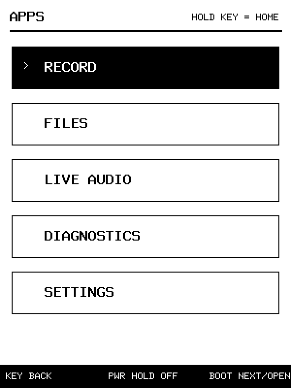 |
| Recorder | Files |
| 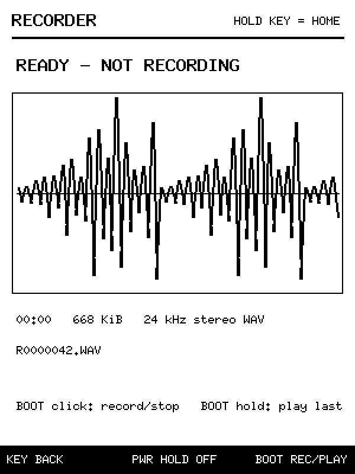 | 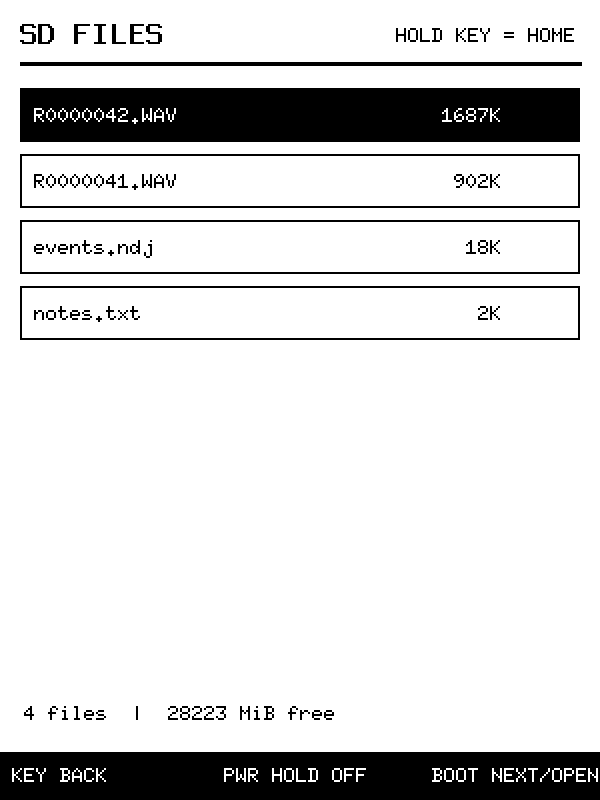 |
| Player | Viewer |
| 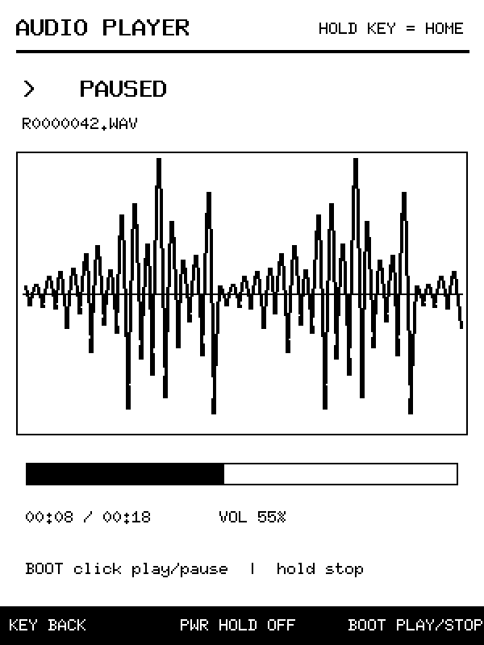 | 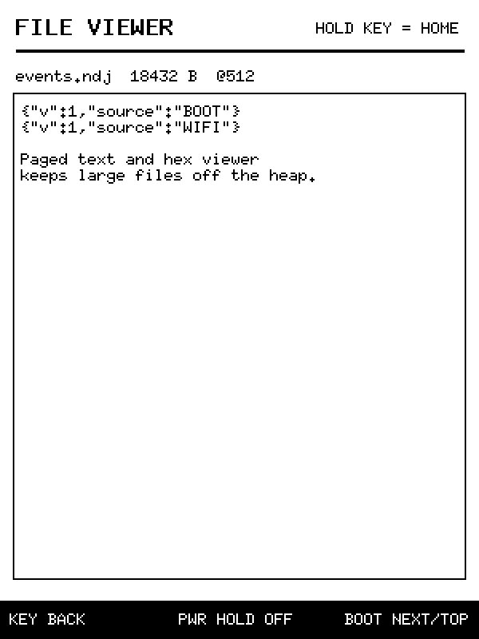 |
| Live | Diagnostics |
| 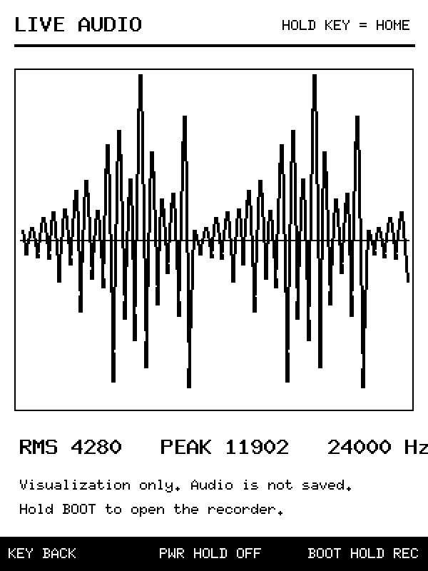 | 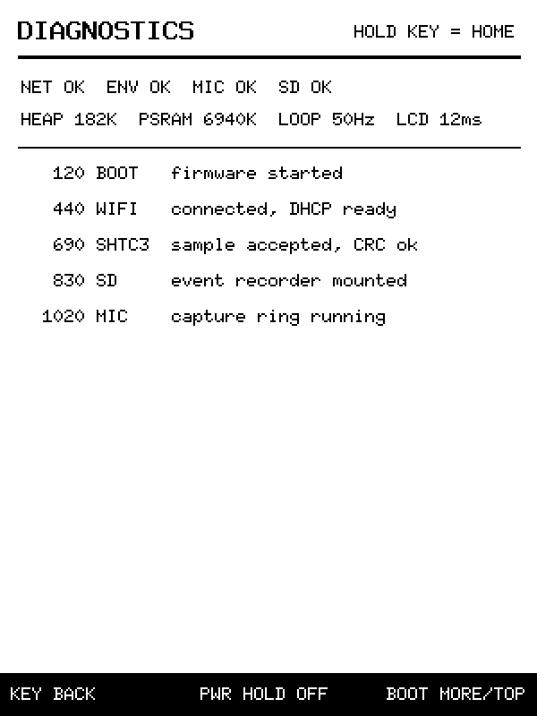 |
| Settings | |
|  | |

### Touch LCD 3.49 V2 preview

These 172x640 RGB565 screens are generated by the same `hmi-core` state used
by the new V2 firmware target.

| Home | Menu | Recorder |
| --- | --- | --- |
| 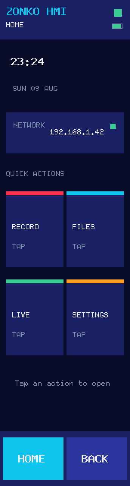 | 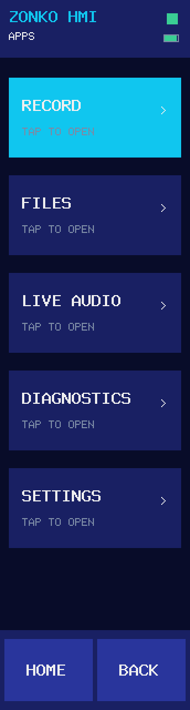 | 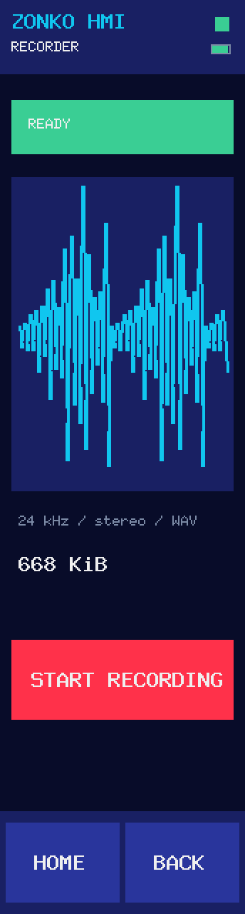 |
| Files | Player | Live |
| 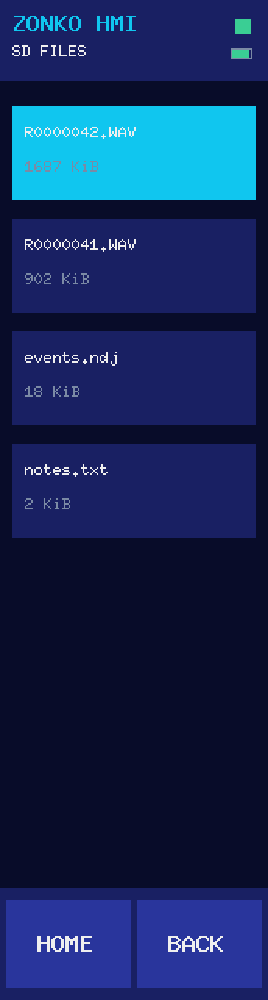 | 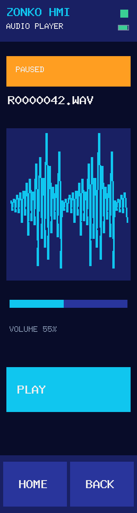 | 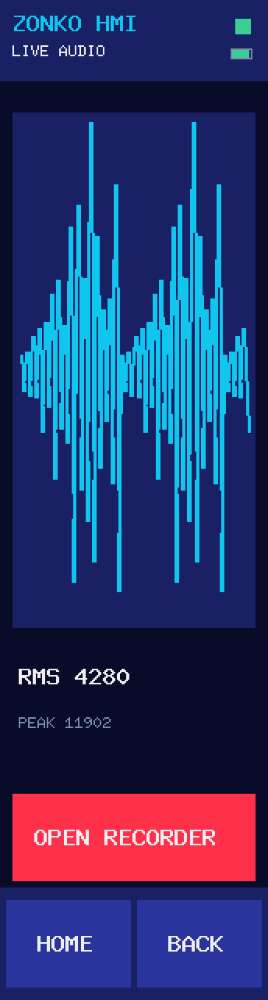 |
| Viewer | Diagnostics | Settings |
| 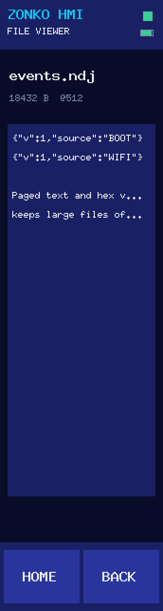 | 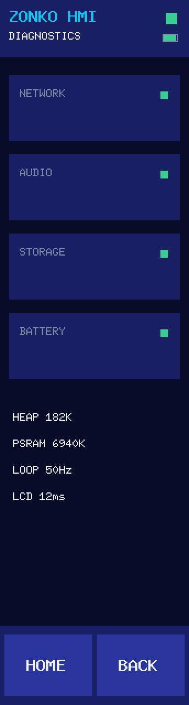 | 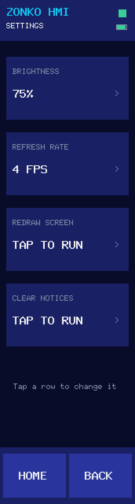 |

Start with:

- [`docs/build-intent.md`](docs/build-intent.md) for the product boundary and
  reference-by-reference analysis.
- [`vendor/README.md`](vendor/README.md) for pinned source management and the
  local Cargo patch layer.
- [`vendor/sources.lock`](vendor/sources.lock) for exact upstream revisions.
- [`docs/firmware.md`](docs/firmware.md) for the portrait device UI, hierarchical
  controls, opt-in recorder, SD viewer, audio player, and build commands.

The upstream checkouts are intentionally ignored by the top-level Git repo.
Restore or verify them with:

```sh
./scripts/vendor-sync.sh
./scripts/vendor-check.sh
```

The first firmware and host simulator now live under `crates/`. Build and test
commands are documented in `docs/firmware.md`. No hardware is flashed by any
build or simulator command.
