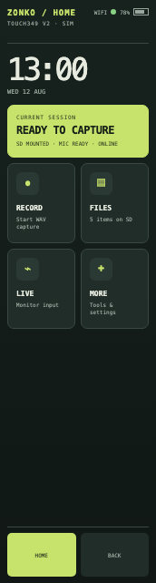
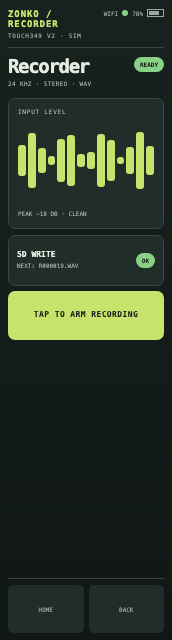
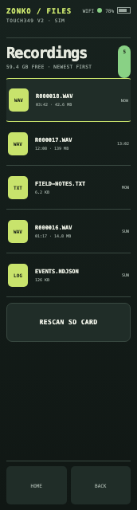
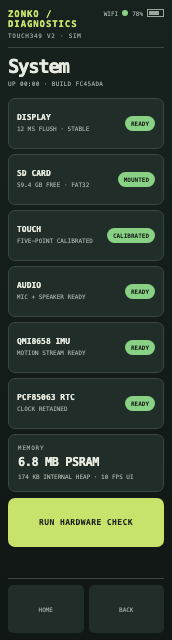
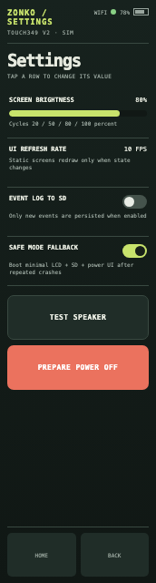
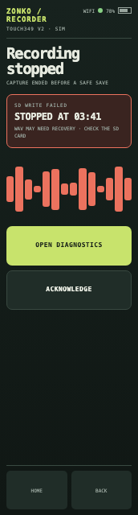

# hmi-esp

Reference and integration workspace for a Rust-first HMI on the exact
Waveshare ESP32-S3-RLCD-4.2 and ESP32-S3-Touch-LCD-3.49 V2 platforms.

The intended product is not a fork of any single example in `vendor/`. It is a
local-rendering device with a shared Rust UI core, a deterministic host
simulator, and an ESP-IDF firmware shell for Wi-Fi, storage, audio, sensors, and
USB Serial/JTAG. HTTP/WebSocket transport, a versioned remote protocol, and OTA
remain planned rather than implemented.

## Touch LCD 3.49 V2 UI emulator

The full browser emulator runs without hardware. It models touch flows,
recording, files, playback, diagnostics, calibration, settings, power, and
deterministic fault scenarios.

```sh
./scripts/open-touch349-emulator.sh
```

These screenshots come from the current emulator at the exact 172x640 native
viewport. They do not prove physical-device behavior.

| Home | Recorder | Files |
| --- | --- | --- |
|  |  |  |
| Diagnostics | Settings | SD fault |
|  |  |  |

The emulator is a product-design tool. The current physical proof covers LCD
output, SD mount, and the active-low GPIO16 power path. Other device states in
the emulator are simulations until they pass direct hardware tests.

Start with:

- [`docs/build-intent.md`](docs/build-intent.md) for the product boundary and
  reference-by-reference analysis.
- [`vendor/README.md`](vendor/README.md) for pinned source management and the
  local Cargo patch layer.
- [`vendor/sources.lock`](vendor/sources.lock) for exact upstream revisions.
- [`docs/firmware.md`](docs/firmware.md) for the portrait device UI, hierarchical
  controls, opt-in recorder, SD viewer, audio player, and build commands.

The upstream checkouts are intentionally ignored by the top-level Git repo.
Restore or verify them with:

```sh
./scripts/vendor-sync.sh
./scripts/vendor-check.sh
```

The first firmware and host simulator now live under `crates/`. Build and test
commands are documented in `docs/firmware.md`. No hardware is flashed by any
build or simulator command.
